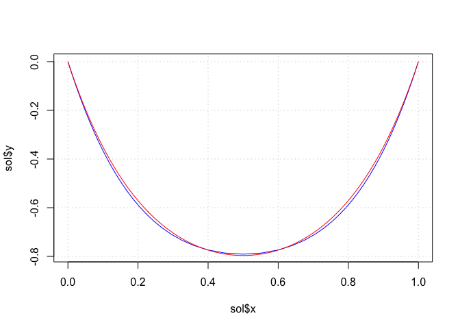
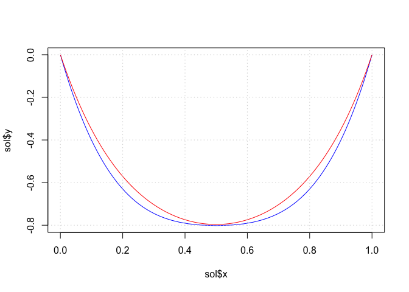

The Catenary as an Convex Optimization Problem
================
Changcheng Li
2017/6/22

Introduction
------------

This example is inspired by Hans W Borchers' excellent example in treating catenary as an optimization problem and using different optimization methods in `R` to deal with it: <http://hwborchers.lima-city.de/Presents/catenary.html>.

And here we will treat it as a convex optimization problem and use `convexjlr` to deal with it.

The `convexjlr` library needs to be loaded and `setup()` will do some initial setup, like connecting to `Julia`, installing `Julia` packages `Convex.jl` and `SCS.jl` if needed, and etc.

``` r
library(convexjlr)
```

    ## 
    ## Attaching package: 'convexjlr'

    ## The following object is masked from 'package:base':
    ## 
    ##     norm

``` r
setup()
```

    ## Doing initialization. It may take some time. Please wait.

    ## [1] TRUE

And this is our function to calculate the contenary curve using `convexjlr`:

``` r
diff_mat <- function(N){
    outer(1:(N - 1), 1:N, function(i, j){(j - i == 1) - (i == j)})
}

catenary <- function(beginx, beginy, endx, endy, N, L){
    ## x coordinates of the nodes
    x <- Variable(N)
    ## y coordinates
    y <- Variable(N)
    ## h is the length of curve between two adjacent nodes
    h <- L / (N - 1)
    diff_matrix <- J(diff_mat(N))
    ## diffx = diff(x) 
    ## but currently diff is not supported in Convex.jl and thus convexjlr
    ## so we use the cumbersome way here to generate diff(x)
    diffx <- Expr(diff_matrix %*% x)
    diffy <- Expr(diff_matrix %*% y)
    ## Gravity draws the curve downward, sum(y) should be minimum.
    p1 <- minimize(sum(y))
    ## The length of each piece of curve should not exceed h.
    p1 <- addConstraint(p1, diffx ^ 2 + diffy ^ 2 <= h ^ 2)
    ## The two ends of curve are fixed at given points.
    p1 <- addConstraint(p1, x[1] == beginx, x[N] == endx, y[1] == beginy, y[N] == endy)
    cvx_optim(p1)
    list(x = value(x), y = value(y))
}
```

As to the function parameters, `beginx`, `beginy`, `endx` and `endy` are coordinates of the two ends of the curve. `N` is the number of nodes you want to use to approximate the curve. And `L` is the total length of the curve.

The steps in the function are commented in detail. The users need to pay extra attention to the way that we deal with `diff(x)` and `diff(y)`. The function `diff` is not supported in Julia package `Convex.jl`, and it is currently not supported by `convexjlr` yet. We notice that what `diff` does is just a linear transform of its input, so we construct the corresponding transformation matrix by `diff_mat`, and use it in our convex problem construction. Interested readers can see further discussion below.

Now we can see a little example using the `catenary` function we have just built. We choose the two ends for the curve to be `(0, 0)` and `(1, 0)`, the number of nodes to be 51, the total length of curve to be 2, and compare our optimization result (blue curve) to the theorectical one (red curve).

``` r
sol <- catenary(0, 0, 1, 0, 51, 2)
plot(sol$x, sol$y,type = "l", col = "blue")

a <- 0.22964
curve(a * cosh((x - 0.5) / a) - 1.02603, 0, 1, col = "red", add = TRUE)
grid()
```



Discussions
-----------

### Problem with too many number of nodes?

One problem in using `convexjlr` to deal with catenary problem is that when the number of nodes is not that large (like 51 nodes), the optimization result fits the theoretical value well, but as the number of nodes gets larger, the optimization result diverges from the theoretical value instead of converging to it, which is kind of weird. For example, there are 101 nodes:

``` r
sol <- catenary(0, 0, 1, 0, 101, 2)
plot(sol$x, sol$y,type = "l", col = "blue")

a <- 0.22964
curve(a * cosh((x - 0.5) / a) - 1.02603, 0, 1, col = "red", add = TRUE)
grid()
```



I tried to find the cause of the problem but failed, maybe numerical issue?

### Problem with `diff`

Another problem is in treating `diff`. We already use linear transformation to achieve the functionality with `diff`, but this method has two problems.

-   The method we use is cubersome, and adds boilerplate we don't want.

-   The method has some limitations and performance issues. In this method, we first construct a matrix in `R` and send it to `Julia`. When the matrix is large, the process can take a great amount of time. In this example, when `N` is larger like 1000, the sending process can consume more time than actual computation.

I already came up with a method which deals with these problems, and `diff` function will work in the next version of `convexjlr`.
